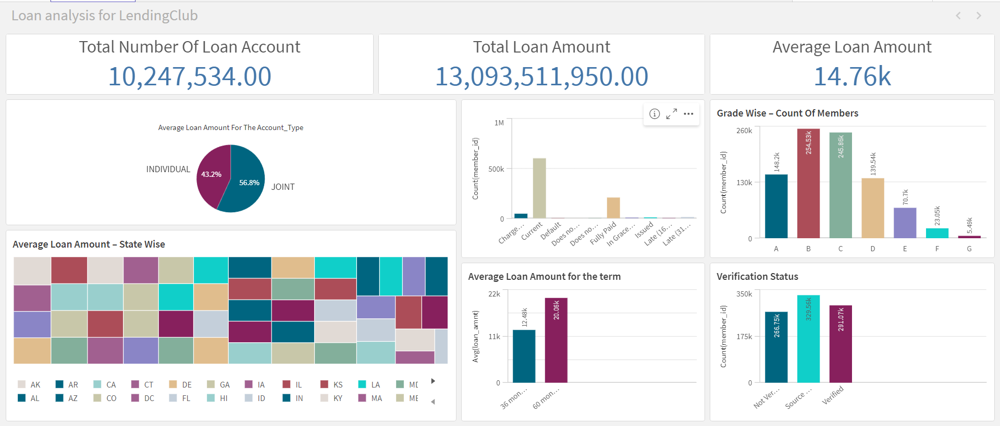

# Enhanced Lending Strategy Using Qlik Cloud for Analyzing LendingClub Loan Data

 <!-- Optional: Add a logo or screenshot here -->

## Project Overview

The goal of this project is to enhance our lending strategy by leveraging Qlik Cloud, an industry-leading analytics solution, to analyze and visualize LendingClub loan data. Our current strategy lacks sufficient data-driven insights, leading to challenges in accurate risk identification, predicting loan defaults, and dynamically adjusting lending criteria in response to market conditions.

### Objectives

- **Risk Identification:** Develop robust methods for accurately assessing borrower risk using detailed analysis of LendingClub loan data.
  
- **Default Prediction:** Create predictive insights to forecast loan default rates with higher precision.
  
- **Dynamic Lending Criteria:** Implement a system for adjusting lending criteria based on real-time market data and borrower behavior trends using Qlik Cloud capabilities.

## Scope

This project encompasses the following key activities:

- **Data Collection and Preparation:** Utilize Qlik Cloud for importing and preparing LendingClub loan data, ensuring accuracy and completeness.
  
- **Visual Data Exploration:** Leverage Qlik Cloud’s intuitive interface for exploratory data analysis (EDA) to uncover patterns and insights related to borrower behavior and market dynamics.
  
- **Insightful Dashboard Creation:** Develop interactive dashboards in Qlik Cloud to visualize key metrics and facilitate data-driven decision-making.
  
- **Strategic Insights Implementation:** Integrate Qlik Cloud insights into our lending strategy to dynamically adjust lending criteria and improve risk management.

## Deliverables

- **Comprehensive Data Insights:** Detailed analysis and visualizations using Qlik Cloud, including descriptive statistics and interactive dashboards.
  
- **Strategic Recommendations:** Insights derived from Qlik Cloud analysis to enhance risk assessment and loan default prediction.
  
- **Dynamic Lending Strategy:** Implementation of Qlik Cloud-driven adjustments to lending criteria, documented with strategic insights and user guides.

## Timeline

| Phase                      | 
|----------------------------|
| Data Collection & Preparation | 
| Visual Data Exploration    | 
| Dashboard Development     | 
| Strategy Implementation   | 
| Testing & Finalization    |

## Qlik Cloud Capabilities Used

- **Data Preparation:** Qlik Cloud's data integration and preparation tools.
  
- **Visual Analytics:** Interactive dashboards and visualizations for in-depth data exploration.
  
- **Insights Delivery:** Real-time insights for dynamic decision-making.

## Team Roles

- **Project Manager:** Oversees project progress and ensures alignment with strategic objectives using Qlik Cloud.
  
- **Data Analyst:** Responsible for data collection, preparation, and insightful analysis using Qlik Cloud.
  
- **Business Analyst:** Utilizes Qlik Cloud to derive strategic insights and recommendations for enhancing lending strategy.

## Contact

- **Email:** [aadeshvinodpal339@gmail.com](aadeshvinodpal@gmail.com)
